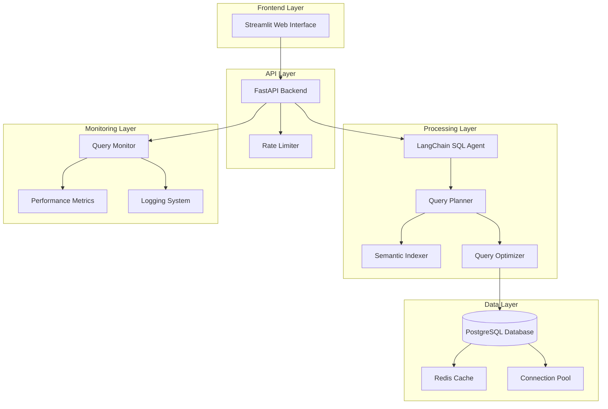

# Design Document

## Overview

The Quick Commerce Deals platform is a sophisticated price comparison system that leverages natural language processing to convert user queries into optimized SQL operations across a comprehensive database schema. The system uses FastAPI for the backend API layer, LangChain 0.3+ for NLP-to-SQL conversion, and Streamlit for the user interface, with advanced query optimization and semantic table selection capabilities.

## Architecture

### High-Level Architecture



### Component Interaction Flow

1. **User Query Input**: User enters natural language query via Streamlit interface
2. **API Processing**: FastAPI receives query, applies rate limiting and basic validation
3. **NLP Processing**: LangChain agent processes natural language and generates SQL intent
4. **Semantic Analysis**: Semantic indexer identifies relevant tables from 50+ available tables
5. **Query Planning**: Query planner determines optimal join paths and execution strategy
6. **Query Optimization**: Query optimizer applies performance enhancements and caching
7. **Database Execution**: Optimized query executes against PostgreSQL with connection pooling
8. **Result Processing**: Results are formatted, cached, and returned to the frontend

## Components and Interfaces

### 1. Database Schema Design

#### Core Tables Structure (50+ Tables)

**Platform Management Tables:**
- `platforms` - Platform information (Blinkit, Zepto, etc.)
- `platform_categories` - Category mappings per platform
- `platform_regions` - Geographic coverage
- `platform_delivery_zones` - Delivery area definitions

**Product Catalog Tables:**
- `products` - Master product catalog
- `product_categories` - Hierarchical category structure
- `product_subcategories` - Detailed subcategory mappings
- `product_brands` - Brand information
- `product_variants` - Size, weight, packaging variants
- `product_attributes` - Nutritional info, organic flags, etc.
- `product_images` - Image URLs and metadata
- `product_descriptions` - Detailed product descriptions
- `product_keywords` - Search optimization keywords
- `product_synonyms` - Alternative product names

**Pricing Tables:**
- `current_prices` - Real-time pricing data
- `price_history` - Historical price tracking
- `price_changes` - Price change events and timestamps
- `bulk_pricing` - Quantity-based pricing tiers
- `membership_prices` - Platform-specific member pricing
- `surge_pricing` - Dynamic pricing during high demand

**Discount and Promotion Tables:**
- `discounts` - Active discount information
- `discount_history` - Historical discount tracking
- `coupon_codes` - Platform-specific coupon codes
- `promotional_campaigns` - Marketing campaign data
- `cashback_offers` - Cashback and reward programs
- `bundle_deals` - Product bundle promotions
- `flash_sales` - Time-limited sale events

**Inventory and Availability Tables:**
- `inventory_levels` - Current stock levels
- `availability_status` - Real-time availability flags
- `stock_alerts` - Low stock notifications
- `delivery_estimates` - Estimated delivery times
- `service_areas` - Delivery coverage areas
- `inventory_history` - Stock level changes over time

**User and Transaction Tables:**
- `users` - User account information
- `user_preferences` - Shopping preferences and history
- `search_history` - User query patterns
- `price_alerts` - User-configured price notifications
- `shopping_lists` - Saved shopping lists
- `comparison_history` - Previous price comparisons

**Analytics and Monitoring Tables:**
- `query_logs` - SQL query execution logs
- `performance_metrics` - System performance data
- `api_usage_stats` - API endpoint usage statistics
- `error_logs` - System error tracking
- `user_behavior_analytics` - User interaction patterns
- `platform_performance` - Platform response time metrics

**Geographic and Logistics Tables:**
- `cities` - Supported city information
- `postal_codes` - Delivery area postal codes
- `delivery_slots` - Available delivery time slots
- `warehouse_locations` - Platform warehouse data
- `delivery_partners` - Third-party delivery services

#### Database Schema Implementation

```sql
-- Core platform table
CREATE TABLE platforms (
    id SERIAL PRIMARY KEY,
    name VARCHAR(100) NOT NULL UNIQUE,
    api_endpoint VARCHAR(255),
    is_active BOOLEAN DEFAULT true,
    created_at TIMESTAMP DEFAULT CURRENT_TIMESTAMP,
    updated_at TIMESTAMP DEFAULT CURRENT_TIMESTAMP
);

-- Master product catalog
CREATE TABLE products (
    id SERIAL PRIMARY KEY,
    name VARCHAR(255) NOT NULL,
    brand_id INTEGER REFERENCES product_brands(id),
    category_id INTEGER REFERENCES product_categories(id),
    barcode VARCHAR(50),
    description TEXT,
    created_at TIMESTAMP DEFAULT CURRENT_TIMESTAMP,
    updated_at TIMESTAMP DEFAULT CURRENT_TIMESTAMP
);

-- Real-time pricing with indexing for performance
CREATE TABLE current_prices (
    id SERIAL PRIMARY KEY,
    product_id INTEGER REFERENCES products(id),
    platform_id INTEGER REFERENCES platforms(id),
    price DECIMAL(10,2) NOT NULL,
    original_price DECIMAL(10,2),
    discount_percentage DECIMAL(5,2),
    is_available BOOLEAN DEFAULT true,
    last_updated TIMESTAMP DEFAULT CURRENT_TIMESTAMP,
    UNIQUE(product_id, platform_id)
);

-- Indexes for performance optimization
CREATE INDEX idx_current_prices_product_platform ON current_prices(product_id, platform_id);
CREATE INDEX idx_current_prices_price ON current_prices(price);
CREATE INDEX idx_current_prices_updated ON current_prices(last_updated);
```

### 2. FastAPI Backend Architecture

#### API Structure

```python
# Main FastAPI application structure
from fastapi import FastAPI, HTTPException, Depends
from fastapi.middleware.cors import CORSMiddleware
from fastapi.middleware.trustedhost import TrustedHostMiddleware
from slowapi import Limiter, _rate_limit_exceeded_handler
from slowapi.util import get_remote_address
from slowapi.errors import RateLimitExceeded

app = FastAPI(
    title="Quick Commerce Deals API",
    description="Price comparison platform for quick commerce apps",
    version="1.0.0"
)

# Rate limiting configuration
limiter = Limiter(key_func=get_remote_address)
app.state.limiter = limiter
app.add_exception_handler(RateLimitExceeded, _rate_limit_exceeded_handler)
```

#### API Endpoints Design

```python
# Core API endpoints
@app.post("/api/v1/query")
@limiter.limit("10/minute")
async def process_natural_language_query(
    query: NaturalLanguageQuery,
    request: Request
) -> QueryResponse:
    """Process natural language query and return results"""
    pass

@app.get("/api/v1/products/compare")
@limiter.limit("20/minute")
async def compare_products(
    product_name: str,
    platforms: List[str] = None
) -> ProductComparison:
    """Compare product prices across platforms"""
    pass

@app.get("/api/v1/deals")
@limiter.limit("30/minute")
async def get_deals(
    platform: str = None,
    category: str = None,
    min_discount: float = 0
) -> DealsResponse:
    """Get current deals and discounts"""
    pass
```

### 3. LangChain v0.3+ SQL Agent Integration

#### Custom SQL Agent Architecture

```python
# LangChain v0.3+ imports
from langchain_community.agent_toolkits import create_sql_agent
from langchain_community.agent_toolkits import SQLDatabaseToolkit
from langchain_community.utilities import SQLDatabase
from langchain_openai import ChatOpenAI
from langchain.agents import AgentType

class CustomSQLAgent:
    def __init__(self, database_uri: str):
        self.db = SQLDatabase.from_uri(database_uri)
        self.toolkit = SQLDatabaseToolkit(db=self.db, llm=OpenAI())
        self.agent = create_sql_agent(
            llm=OpenAI(),
            toolkit=self.toolkit,
            verbose=True,
            agent_type=AgentType.ZERO_SHOT_REACT_DESCRIPTION,
            handle_parsing_errors=True
        )
        self.semantic_indexer = SemanticTableIndexer(self.db)
        self.query_planner = QueryPlanner(self.db)
    
    async def process_query(self, natural_language_query: str) -> dict:
        """Process natural language query with intelligent table selection"""
        # Step 1: Semantic analysis to identify relevant tables
        relevant_tables = await self.semantic_indexer.get_relevant_tables(
            natural_language_query
        )
        
        # Step 2: Query planning and optimization
        query_plan = await self.query_planner.create_execution_plan(
            natural_language_query, relevant_tables
        )
        
        # Step 3: Execute with LangChain agent
        result = await self.agent.arun(
            f"Using tables {relevant_tables}, {natural_language_query}"
        )
        
        return {
            "query": natural_language_query,
            "relevant_tables": relevant_tables,
            "execution_plan": query_plan,
            "results": result
        }
```

#### Semantic Table Indexer

```python
class SemanticTableIndexer:
    def __init__(self, database):
        self.db = database
        self.table_embeddings = {}
        self.column_embeddings = {}
        self._build_semantic_index()
    
    def _build_semantic_index(self):
        """Build semantic embeddings for all tables and columns"""
        # Create embeddings for table names, column names, and sample data
        # Use sentence transformers or similar for semantic similarity
        pass
    
    async def get_relevant_tables(self, query: str, top_k: int = 10) -> List[str]:
        """Return most relevant tables based on semantic similarity"""
        # Calculate similarity between query and table/column embeddings
        # Return top-k most relevant tables
        pass
```

### 4. Query Planning and Optimization

#### Query Planner Implementation

```python
class QueryPlanner:
    def __init__(self, database):
        self.db = database
        self.join_graph = self._build_join_graph()
        self.query_cache = {}
    
    def _build_join_graph(self):
        """Build graph of table relationships for optimal join planning"""
        # Analyze foreign key relationships
        # Create weighted graph for join path optimization
        pass
    
    async def create_execution_plan(self, query: str, tables: List[str]) -> dict:
        """Create optimized execution plan for multi-table queries"""
        # Determine optimal join order
        # Identify potential indexes to use
        # Estimate query cost and suggest optimizations
        pass
    
    def optimize_query(self, sql_query: str) -> str:
        """Apply query optimization techniques"""
        # Add appropriate indexes hints
        # Optimize WHERE clause ordering
        # Suggest query restructuring if needed
        pass
```

### 5. Caching Strategy

#### Multi-Level Caching Implementation

```python
class CacheManager:
    def __init__(self):
        self.redis_client = redis.Redis(host='localhost', port=6379, db=0)
        self.schema_cache = {}
        self.query_result_cache = {}
    
    async def get_cached_result(self, query_hash: str) -> Optional[dict]:
        """Retrieve cached query result"""
        cached = await self.redis_client.get(f"query:{query_hash}")
        return json.loads(cached) if cached else None
    
    async def cache_result(self, query_hash: str, result: dict, ttl: int = 300):
        """Cache query result with TTL"""
        await self.redis_client.setex(
            f"query:{query_hash}", 
            ttl, 
            json.dumps(result)
        )
    
    def get_schema_cache(self, table_name: str) -> Optional[dict]:
        """Get cached table schema information"""
        return self.schema_cache.get(table_name)
```

### 6. Streamlit Frontend Design

#### User Interface Components

```python
import streamlit as st
import requests
import pandas as pd
import plotly.express as px

class QuickCommerceUI:
    def __init__(self):
        self.api_base_url = "http://localhost:8000/api/v1"
    
    def render_main_interface(self):
        """Render main Streamlit interface"""
        st.title("🛒 Quick Commerce Price Comparison")
        
        # Query input section
        query = st.text_input(
            "Ask me anything about prices and deals:",
            placeholder="Which app has cheapest onions right now?"
        )
        
        if st.button("Search"):
            self.process_query(query)
        
        # Sample queries section
        st.sidebar.header("Sample Queries")
        sample_queries = [
            "Which app has cheapest onions right now?",
            "Show products with 30%+ discount on Blinkit",
            "Compare fruit prices between Zepto and Instamart",
            "Find best deals for ₹1000 grocery list"
        ]
        
        for sample in sample_queries:
            if st.sidebar.button(sample):
                self.process_query(sample)
    
    def process_query(self, query: str):
        """Process user query and display results"""
        with st.spinner("Searching across platforms..."):
            response = requests.post(
                f"{self.api_base_url}/query",
                json={"query": query}
            )
            
            if response.status_code == 200:
                self.display_results(response.json())
            else:
                st.error("Failed to process query")
    
    def display_results(self, results: dict):
        """Display query results in user-friendly format"""
        # Create comparison tables, charts, and visualizations
        # Highlight best deals and savings
        pass
```

## Data Models

### Core Data Models

```python
from pydantic import BaseModel
from typing import List, Optional, Dict
from datetime import datetime
from decimal import Decimal

class Platform(BaseModel):
    id: int
    name: str
    is_active: bool
    api_endpoint: Optional[str]

class Product(BaseModel):
    id: int
    name: str
    brand: str
    category: str
    description: Optional[str]
    barcode: Optional[str]

class PriceData(BaseModel):
    product_id: int
    platform_id: int
    current_price: Decimal
    original_price: Optional[Decimal]
    discount_percentage: Optional[Decimal]
    is_available: bool
    last_updated: datetime

class NaturalLanguageQuery(BaseModel):
    query: str
    user_id: Optional[str]
    context: Optional[Dict]

class QueryResponse(BaseModel):
    query: str
    results: List[Dict]
    execution_time: float
    relevant_tables: List[str]
    total_results: int
    cached: bool

class ProductComparison(BaseModel):
    product_name: str
    platforms: List[Dict]
    best_deal: Dict
    savings_potential: Decimal
```

## Error Handling

### Comprehensive Error Management

```python
class CustomExceptions:
    class QueryProcessingError(Exception):
        """Raised when natural language query cannot be processed"""
        pass
    
    class DatabaseConnectionError(Exception):
        """Raised when database connection fails"""
        pass
    
    class RateLimitExceededError(Exception):
        """Raised when API rate limits are exceeded"""
        pass
    
    class InvalidQueryError(Exception):
        """Raised when generated SQL query is invalid"""
        pass

# Error handling middleware
@app.exception_handler(QueryProcessingError)
async def query_processing_error_handler(request: Request, exc: QueryProcessingError):
    return JSONResponse(
        status_code=400,
        content={
            "error": "Query Processing Failed",
            "message": str(exc),
            "suggestions": [
                "Try rephrasing your query",
                "Use more specific product names",
                "Check spelling and grammar"
            ]
        }
    )
```

## Testing Strategy

### Multi-Layer Testing Approach

#### 1. Unit Testing
- Database model validation
- SQL query generation accuracy
- Semantic indexing functionality
- Cache operations
- API endpoint responses

#### 2. Integration Testing
- LangChain agent integration
- Database connection pooling
- Redis caching integration
- FastAPI-Streamlit communication

#### 3. Performance Testing
- Query execution time benchmarks
- Concurrent user load testing
- Database performance under high-frequency updates
- Cache hit ratio optimization

#### 4. End-to-End Testing
- Complete user journey testing
- Sample query accuracy validation
- Cross-platform price comparison accuracy
- Error handling and recovery testing

```python
# Example test structure
import pytest
from fastapi.testclient import TestClient
from app.main import app

client = TestClient(app)

class TestNaturalLanguageQueries:
    def test_cheapest_product_query(self):
        """Test 'Which app has cheapest onions right now?' query"""
        response = client.post(
            "/api/v1/query",
            json={"query": "Which app has cheapest onions right now?"}
        )
        assert response.status_code == 200
        assert "results" in response.json()
        assert len(response.json()["results"]) > 0
    
    def test_discount_query(self):
        """Test discount-based queries"""
        response = client.post(
            "/api/v1/query",
            json={"query": "Show products with 30%+ discount on Blinkit"}
        )
        assert response.status_code == 200
        # Verify all results have discount >= 30%
        for result in response.json()["results"]:
            assert result["discount_percentage"] >= 30
```

## Performance Considerations

### Optimization Strategies

1. **Database Optimization**
   - Proper indexing on frequently queried columns
   - Partitioning large tables by date/platform
   - Query execution plan analysis and optimization
   - Connection pooling with optimal pool sizes

2. **Caching Strategy**
   - Multi-level caching (application, query result, schema)
   - Cache invalidation strategies for real-time data
   - Redis clustering for high availability
   - Cache warming for frequently accessed data

3. **Query Optimization**
   - Intelligent table selection to reduce join complexity
   - Query result pagination for large datasets
   - Statistical sampling for approximate results when appropriate
   - Prepared statement caching

4. **API Performance**
   - Asynchronous request handling
   - Response compression
   - Rate limiting to prevent abuse
   - Request/response caching

## Security Considerations

### Security Implementation

1. **API Security**
   - Rate limiting per IP/user
   - Input validation and sanitization
   - SQL injection prevention
   - CORS configuration

2. **Database Security**
   - Parameterized queries only
   - Database user with minimal required permissions
   - Connection encryption
   - Query logging and monitoring

3. **Data Protection**
   - No sensitive user data storage
   - Anonymized query logging
   - Secure configuration management
   - Regular security audits

This design provides a comprehensive foundation for building the Quick Commerce Deals platform with all the technical requirements specified in your problem statement.