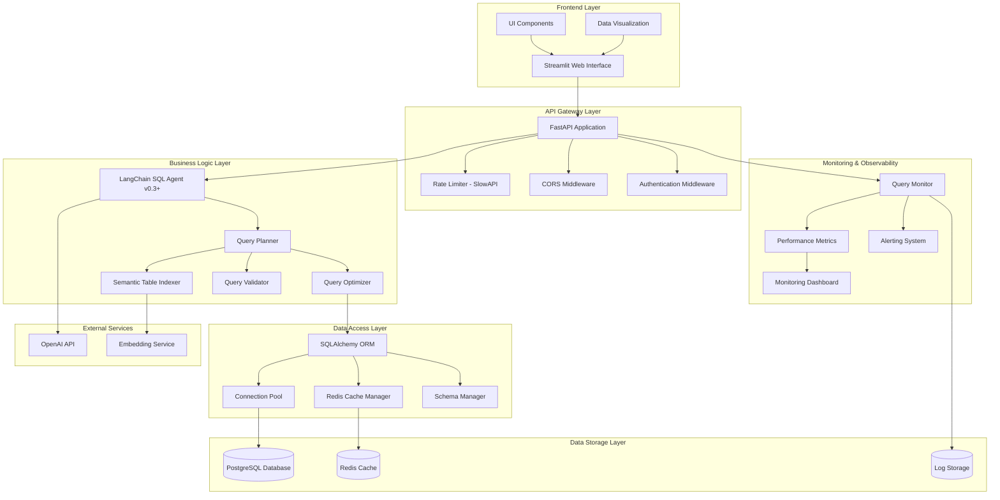
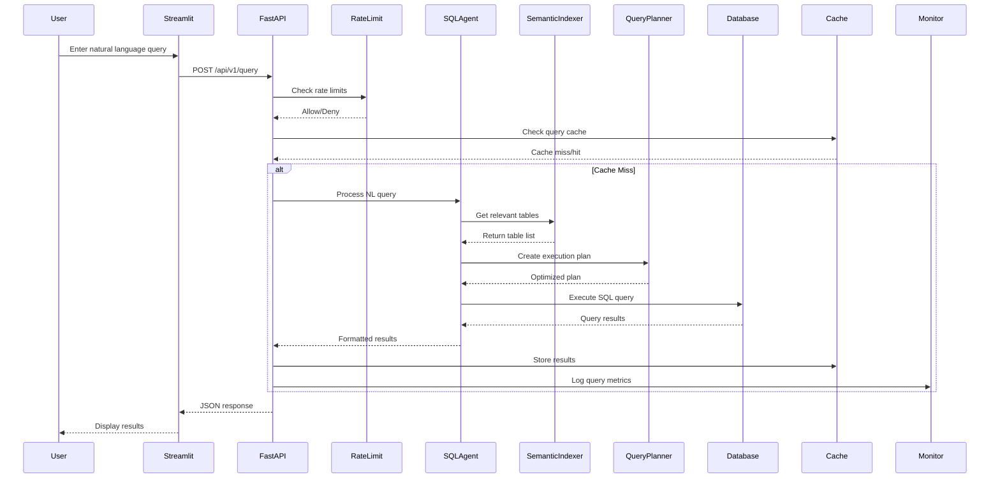
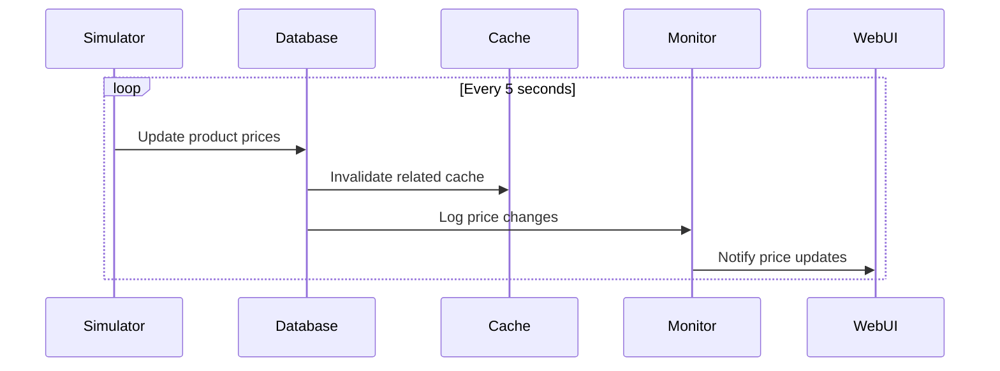
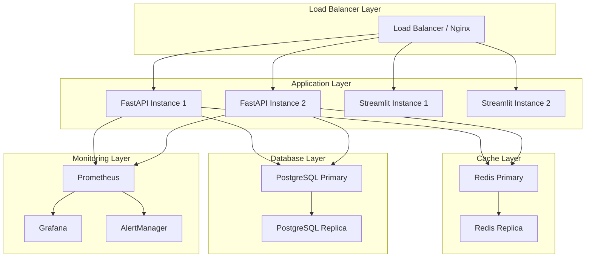

# Quick Commerce Deals - System Architecture Documentation

## Table of Contents
1. [System Overview](#system-overview)
2. [Architecture Patterns](#architecture-patterns)
3. [Component Architecture](#component-architecture)
4. [Data Flow](#data-flow)
5. [Database Schema](#database-schema)
6. [API Architecture](#api-architecture)
7. [Technical Decisions](#technical-decisions)
8. [Deployment Architecture](#deployment-architecture)
9. [Infrastructure Requirements](#infrastructure-requirements)
10. [Security Architecture](#security-architecture)
11. [Performance Considerations](#performance-considerations)

## System Overview

The Quick Commerce Deals platform is a sophisticated price comparison system that enables users to query pricing, discounts, and availability across multiple quick commerce platforms (Blinkit, Zepto, Instamart, BigBasket Now) using natural language queries. The system leverages advanced NLP-to-SQL conversion, semantic table selection, and intelligent query optimization.

### Key Features
- Natural language query processing using LangChain v0.3+
- Real-time price comparison across 4+ platforms
- Intelligent SQL generation with semantic table selection
- Multi-step query validation and optimization
- Comprehensive caching strategy with Redis
- RESTful API with FastAPI
- Interactive web interface with Streamlit
- 50+ database tables with optimized schema design

## Architecture Patterns

### 1. Layered Architecture
The system follows a layered architecture pattern with clear separation of concerns:

```
┌─────────────────────────────────────┐
│           Frontend Layer            │
│         (Streamlit UI)              │
├─────────────────────────────────────┤
│            API Layer                │
│      (FastAPI + Rate Limiting)      │
├─────────────────────────────────────┤
│         Processing Layer            │
│  (LangChain + Query Planning +      │
│   Semantic Indexing + Optimization) │
├─────────────────────────────────────┤
│           Data Layer                │
│    (PostgreSQL + Redis Cache +      │
│      Connection Pooling)            │
├─────────────────────────────────────┤
│         Monitoring Layer            │
│   (Logging + Metrics + Analytics)   │
└─────────────────────────────────────┘
```

### 2. Microservices-Ready Design
While deployed as a monolith initially, the architecture supports future microservices decomposition:
- **Query Service**: Natural language processing and SQL generation
- **Price Service**: Price comparison and deal aggregation
- **Cache Service**: Distributed caching and invalidation
- **Analytics Service**: Query monitoring and performance metrics

### 3. Event-Driven Components
- Real-time price updates trigger cache invalidation
- Query execution events generate performance metrics
- Error events trigger alerting and logging

## Component Architecture

### High-Level Component Diagram



### Core Components Detail

#### 1. CustomSQLAgent (LangChain Integration)
```python
# Core component for NLP-to-SQL conversion
class CustomSQLAgent:
    - SQLDatabase connection
    - SQLDatabaseToolkit integration
    - Custom prompt engineering
    - Error handling and recovery
    - Multi-step query generation
```

#### 2. SemanticTableIndexer
```python
# Intelligent table selection from 50+ tables
class SemanticTableIndexer:
    - Table/column embedding generation
    - Semantic similarity calculation
    - Relevance scoring algorithm
    - Caching of embeddings
```

#### 3. QueryPlanner
```python
# Query optimization and execution planning
class QueryPlanner:
    - Join graph analysis
    - Execution plan generation
    - Cost estimation
    - Query complexity analysis
```

#### 4. CacheManager
```python
# Multi-level caching strategy
class CacheManager:
    - Query result caching
    - Schema metadata caching
    - Embedding caching
    - Cache invalidation logic
```

## Data Flow

### Query Processing Flow



### Real-time Price Update Flow



## Database Schema

### Schema Overview
The database consists of 50+ tables organized into logical domains:

#### Core Domain Tables (10 tables)
- **platforms**: Platform information and configuration
- **products**: Master product catalog
- **product_categories**: Hierarchical category structure
- **product_brands**: Brand information and metadata
- **product_variants**: Size, weight, packaging variations
- **product_attributes**: Nutritional info, certifications
- **product_images**: Image URLs and metadata
- **product_descriptions**: Detailed product information
- **product_keywords**: Search optimization terms
- **product_synonyms**: Alternative product names

#### Pricing Domain Tables (12 tables)
- **current_prices**: Real-time pricing data
- **price_history**: Historical price tracking
- **price_changes**: Price change events
- **bulk_pricing**: Quantity-based pricing
- **membership_prices**: Platform-specific member pricing
- **surge_pricing**: Dynamic pricing data
- **price_alerts**: User price notifications
- **price_predictions**: ML-based price forecasts
- **competitor_prices**: Cross-platform price analysis
- **price_elasticity**: Demand-price relationship data
- **seasonal_pricing**: Seasonal price patterns
- **regional_pricing**: Geographic price variations

#### Promotion Domain Tables (8 tables)
- **discounts**: Active discount information
- **discount_history**: Historical discount tracking
- **coupon_codes**: Platform-specific coupons
- **promotional_campaigns**: Marketing campaigns
- **cashback_offers**: Reward programs
- **bundle_deals**: Product bundle promotions
- **flash_sales**: Time-limited sales
- **loyalty_programs**: Customer loyalty data

#### Inventory Domain Tables (6 tables)
- **inventory_levels**: Current stock levels
- **availability_status**: Real-time availability
- **stock_alerts**: Low stock notifications
- **delivery_estimates**: Delivery time predictions
- **service_areas**: Delivery coverage
- **inventory_history**: Stock level changes

#### User Domain Tables (6 tables)
- **users**: User account information
- **user_preferences**: Shopping preferences
- **search_history**: Query patterns
- **shopping_lists**: Saved lists
- **comparison_history**: Previous comparisons
- **user_behavior**: Interaction analytics

#### Analytics Domain Tables (8 tables)
- **query_logs**: SQL execution logs
- **performance_metrics**: System performance
- **api_usage_stats**: Endpoint usage
- **error_logs**: Error tracking
- **user_analytics**: User behavior patterns
- **platform_performance**: Platform metrics
- **conversion_tracking**: Purchase conversions
- **ab_test_results**: A/B testing data

### Key Relationships and Constraints

```sql
-- Core relationships
ALTER TABLE products ADD CONSTRAINT fk_products_brand 
    FOREIGN KEY (brand_id) REFERENCES product_brands(id);

ALTER TABLE current_prices ADD CONSTRAINT fk_prices_product 
    FOREIGN KEY (product_id) REFERENCES products(id);

ALTER TABLE current_prices ADD CONSTRAINT fk_prices_platform 
    FOREIGN KEY (platform_id) REFERENCES platforms(id);

-- Performance indexes
CREATE INDEX idx_current_prices_lookup ON current_prices(product_id, platform_id);
CREATE INDEX idx_price_history_timeline ON price_history(product_id, recorded_at);
CREATE INDEX idx_products_search ON products USING gin(to_tsvector('english', name));
```

## API Architecture

### RESTful API Design

#### Endpoint Structure
```
/api/v1/
├── query/                    # Natural language queries
├── products/
│   ├── compare              # Product price comparison
│   ├── search               # Product search
│   └── {id}/prices         # Product price history
├── deals/                   # Deals and discounts
├── platforms/               # Platform information
├── health/                  # Health checks
└── metrics/                 # Performance metrics
```

#### Request/Response Models

```python
# Core API models
class NaturalLanguageQuery(BaseModel):
    query: str
    user_id: Optional[str] = None
    context: Optional[Dict] = None
    max_results: int = 100

class QueryResponse(BaseModel):
    query: str
    results: List[Dict]
    execution_time: float
    relevant_tables: List[str]
    total_results: int
    cached: bool
    suggestions: Optional[List[str]]

class ProductComparison(BaseModel):
    product_name: str
    platforms: List[PlatformPrice]
    best_deal: PlatformPrice
    savings_potential: Decimal
    last_updated: datetime
```

#### Error Handling Strategy

```python
# Standardized error responses
class APIError(BaseModel):
    error_code: str
    message: str
    details: Optional[Dict]
    suggestions: Optional[List[str]]
    timestamp: datetime

# HTTP status code mapping
- 400: Bad Request (invalid query format)
- 429: Too Many Requests (rate limit exceeded)
- 500: Internal Server Error (system failure)
- 503: Service Unavailable (database connection issues)
```

## Technical Decisions

### 1. Technology Stack Rationale

#### Backend Framework: FastAPI
**Decision**: Use FastAPI for the REST API layer
**Rationale**: 
- High performance with async support
- Automatic OpenAPI documentation generation
- Built-in request validation with Pydantic
- Excellent developer experience

#### NLP Framework: LangChain v0.3+
**Decision**: Use LangChain for NLP-to-SQL conversion
**Rationale**:
- Mature SQL agent capabilities
- Extensible toolkit architecture
- Active community and development
- Integration with multiple LLM providers

#### Database: PostgreSQL
**Decision**: Use PostgreSQL as primary database
**Rationale**:
- Excellent performance for complex queries
- Advanced indexing capabilities (GIN, GIST)
- Full-text search support
- ACID compliance for price data integrity

#### Caching: Redis
**Decision**: Use Redis for multi-level caching
**Rationale**:
- High-performance in-memory storage
- Support for complex data structures
- Built-in expiration and eviction policies
- Clustering support for scalability

#### Frontend: Streamlit
**Decision**: Use Streamlit for web interface
**Rationale**:
- Rapid prototyping and development
- Built-in data visualization components
- Python-native development
- Easy deployment and sharing

### 2. Architecture Patterns

#### Semantic Table Selection
**Decision**: Implement custom semantic indexing
**Rationale**:
- 50+ tables require intelligent selection
- Reduces query complexity and execution time
- Improves accuracy of generated SQL
- Enables better user experience

#### Multi-step Query Validation
**Decision**: Break complex queries into validated steps
**Rationale**:
- Improves reliability of SQL generation
- Enables better error handling and recovery
- Provides transparency in query processing
- Allows for intermediate result caching

#### Connection Pooling
**Decision**: Implement database connection pooling
**Rationale**:
- Handles concurrent user requests efficiently
- Reduces connection overhead
- Improves system stability under load
- Enables better resource utilization

### 3. Performance Optimizations

#### Query Result Caching
**Decision**: Multi-level caching with TTL
**Rationale**:
- Reduces database load for repeated queries
- Improves response times significantly
- Balances freshness with performance
- Supports cache invalidation strategies

#### Statistical Sampling
**Decision**: Use sampling for large result sets
**Rationale**:
- Maintains response time for large queries
- Provides representative results
- Reduces memory usage
- Enables pagination for better UX

## Deployment Architecture

### Production Deployment Topology



### Container Architecture

```dockerfile
# Multi-stage Docker build
FROM python:3.11-slim as base
# Base dependencies and security updates

FROM base as api
# FastAPI application container
EXPOSE 8000

FROM base as frontend  
# Streamlit application container
EXPOSE 8501

FROM postgres:15 as database
# PostgreSQL with custom configuration

FROM redis:7-alpine as cache
# Redis with persistence configuration
```

### Environment Configuration

#### Development Environment
- Single container deployment
- SQLite for rapid development
- In-memory caching
- Debug logging enabled

#### Staging Environment
- Multi-container Docker Compose
- PostgreSQL database
- Redis caching
- Production-like data volume

#### Production Environment
- Kubernetes deployment
- High availability database cluster
- Redis cluster with persistence
- Comprehensive monitoring and alerting

## Infrastructure Requirements

### Minimum System Requirements

#### Development Environment
- **CPU**: 2 cores, 2.4 GHz
- **RAM**: 8 GB
- **Storage**: 20 GB SSD
- **Network**: Broadband internet for API calls

#### Production Environment (Single Instance)
- **CPU**: 4 cores, 3.0 GHz
- **RAM**: 16 GB
- **Storage**: 100 GB SSD
- **Network**: 1 Gbps connection

#### Production Environment (High Availability)
- **Application Servers**: 2x (4 cores, 16 GB RAM each)
- **Database Server**: 1x (8 cores, 32 GB RAM, 500 GB SSD)
- **Cache Server**: 1x (4 cores, 8 GB RAM, 50 GB SSD)
- **Load Balancer**: 1x (2 cores, 4 GB RAM)

### Cloud Infrastructure (AWS Example)

#### Compute Resources
- **Application**: 2x EC2 t3.large instances
- **Database**: 1x RDS db.r5.xlarge (PostgreSQL)
- **Cache**: 1x ElastiCache r6g.large (Redis)
- **Load Balancer**: Application Load Balancer

#### Storage Requirements
- **Database**: 500 GB GP3 storage with 3000 IOPS
- **Application Logs**: 100 GB EBS storage
- **Backup Storage**: S3 bucket with lifecycle policies

#### Network Configuration
- **VPC**: Private subnets for database and cache
- **Security Groups**: Restrictive access rules
- **NAT Gateway**: For outbound API calls
- **CloudFront**: CDN for static assets

### Monitoring and Observability

#### Metrics Collection
- **Application Metrics**: Query execution time, error rates
- **System Metrics**: CPU, memory, disk usage
- **Database Metrics**: Connection pool, query performance
- **Cache Metrics**: Hit ratio, memory usage

#### Logging Strategy
- **Application Logs**: Structured JSON logging
- **Access Logs**: Request/response logging
- **Error Logs**: Exception tracking and alerting
- **Audit Logs**: Query history and user actions

#### Alerting Rules
- **High Error Rate**: >5% error rate for 5 minutes
- **Slow Queries**: >10 second query execution time
- **High Memory Usage**: >80% memory utilization
- **Database Connection Issues**: Connection pool exhaustion

## Security Architecture

### Authentication and Authorization
- **API Keys**: For programmatic access
- **Rate Limiting**: IP-based request throttling
- **Input Validation**: Comprehensive request sanitization
- **SQL Injection Prevention**: Parameterized queries only

### Data Security
- **Encryption in Transit**: TLS 1.3 for all connections
- **Encryption at Rest**: Database and cache encryption
- **Sensitive Data**: No PII storage in logs
- **Access Control**: Principle of least privilege

### Network Security
- **Firewall Rules**: Restrictive ingress/egress rules
- **VPN Access**: Secure administrative access
- **DDoS Protection**: Rate limiting and traffic filtering
- **Security Headers**: CORS, CSP, HSTS implementation

## Performance Considerations

### Scalability Patterns

#### Horizontal Scaling
- **Stateless Application Design**: No server-side session storage
- **Database Read Replicas**: Distribute read queries
- **Cache Clustering**: Redis cluster for high availability
- **Load Balancing**: Round-robin with health checks

#### Vertical Scaling
- **Database Optimization**: Index tuning and query optimization
- **Memory Management**: Efficient caching strategies
- **CPU Optimization**: Async processing and connection pooling
- **Storage Performance**: SSD storage with high IOPS

### Performance Targets

#### Response Time Targets
- **Simple Queries**: <500ms (95th percentile)
- **Complex Queries**: <2s (95th percentile)
- **Cache Hits**: <50ms (99th percentile)
- **API Health Check**: <100ms (99th percentile)

#### Throughput Targets
- **Concurrent Users**: 100+ simultaneous users
- **Queries per Second**: 50+ QPS sustained
- **Database Connections**: 100+ concurrent connections
- **Cache Operations**: 1000+ operations per second

#### Availability Targets
- **System Uptime**: 99.9% availability
- **Database Availability**: 99.95% availability
- **Cache Availability**: 99.5% availability
- **API Response Success**: 99.5% success rate

This architecture documentation provides a comprehensive overview of the Quick Commerce Deals platform, covering all aspects from high-level design to detailed implementation considerations. The modular design ensures maintainability, scalability, and extensibility for future enhancements.