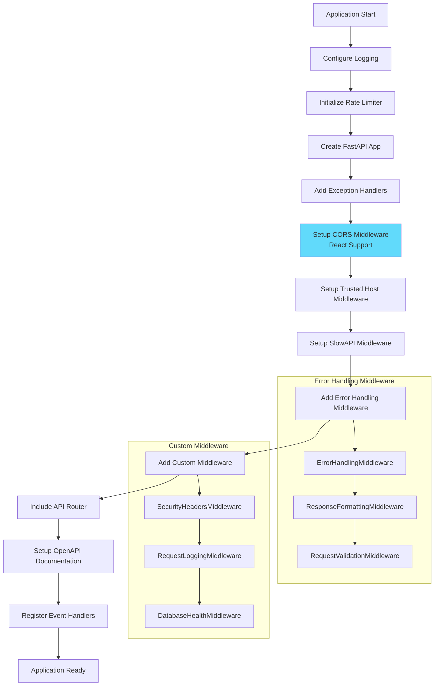
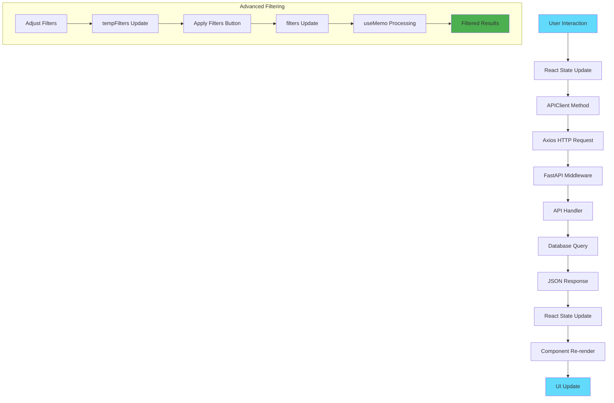
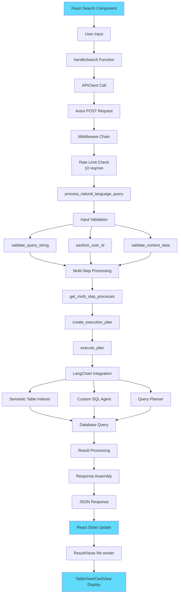
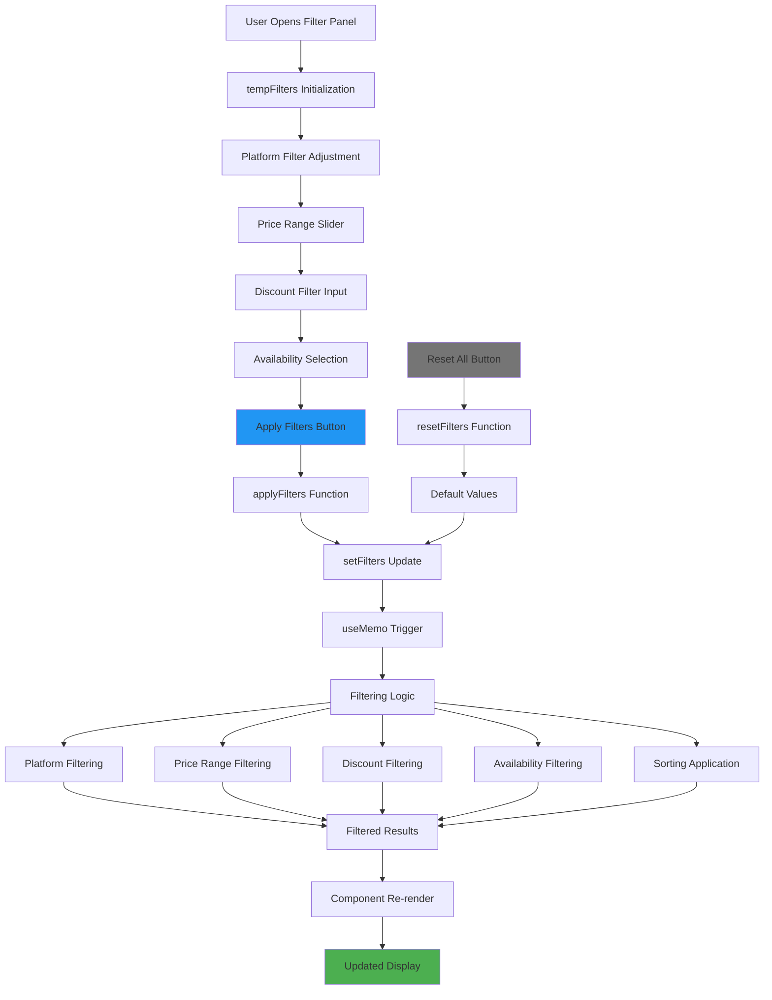
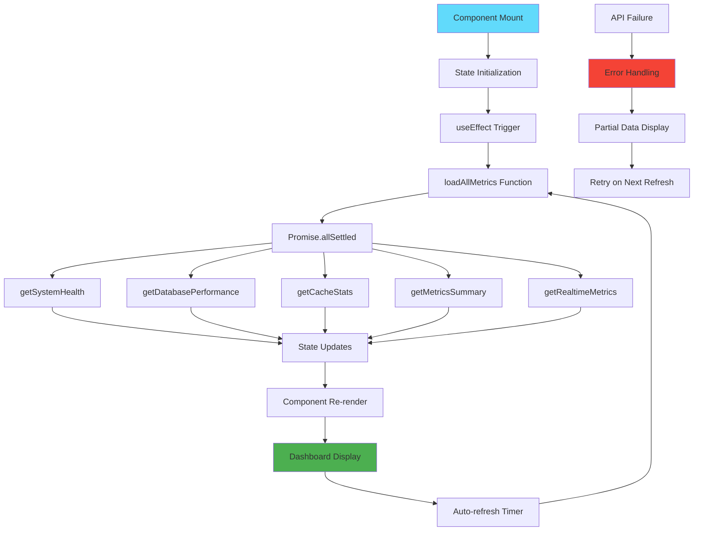
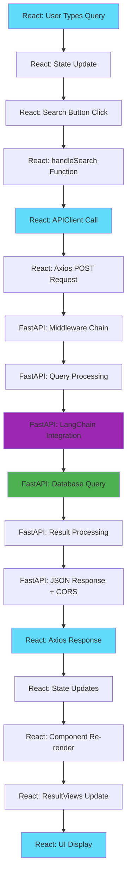
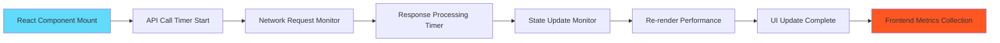

```mermaid
graph LR
    A[React Frontend Request] --> B[SlowAPI Middleware]
    B --> C[Error Handling Middleware]
    C --> D[Response Formatting Middleware]
    D --> E[Request Validation Middleware]
    E --> F[Security Headers + CORS]
    F --> G[Request Logging Middleware]
    G --> H[Database Health Middleware]
    H --> I[CORS Middleware]
    I --> J[Trusted Host Middleware]
    J --> K[Route Handler]
    K --> L[JSON Response Processing]
    L --> M[React Frontend Response]
    
    style A fill:#61dafb
    style F fill:#4caf50
    style M fill:#61dafb
```

# Quick Commerce Deals API - Request Flow Documentation

## Overview

This document provides a comprehensive view of what happens behind the scenes when each API endpoint is called, including the middleware chain, validation processes, database interactions, and response formatting. The system now features a modern React + TypeScript frontend with advanced filtering capabilities and real-time monitoring.

## Table of Contents

1. [Application Startup Flow](#application-startup-flow)
2. [Middleware Chain](#middleware-chain)
3. [Natural Language Query Flow](#natural-language-query-flow)
4. [Product Comparison Flow](#product-comparison-flow)
5. [Deals Discovery Flow](#deals-discovery-flow)
6. [Monitoring Endpoints Flow](#monitoring-endpoints-flow)
7. [Error Handling Flow](#error-handling-flow)
8. [Database Connection Flow](#database-connection-flow)
9. [Frontend Integration Flow](#frontend-integration-flow)

---

## Application Startup Flow

### Arrow Flow
```
Application Start
→ Configure Logging (configure_logging())
→ Initialize Rate Limiter (Limiter)
→ Create FastAPI App Instance
→ Add Exception Handlers (EXCEPTION_HANDLERS)
→ Setup CORS Middleware (React frontend support)
→ Setup Trusted Host Middleware
→ Setup SlowAPI Middleware (Rate Limiting)
→ Add Error Handling Middleware Chain:
  → ErrorHandlingMiddleware
  → ResponseFormattingMiddleware
  → RequestValidationMiddleware
→ Add Custom Middleware Chain:
  → SecurityHeadersMiddleware
  → RequestLoggingMiddleware
  → DatabaseHealthMiddleware
→ Include API Router (api_router)
→ Setup Enhanced OpenAPI Documentation
→ Register Startup Event Handler
→ Register Shutdown Event Handler
→ Application Ready
```

### Mermaid Diagram


---

## Middleware Chain

Every request passes through this middleware chain in order:

### Arrow Flow
```
Incoming Request (React Frontend)
→ SlowAPIMiddleware (Rate Limiting Check)
→ ErrorHandlingMiddleware (Global Error Handling)
→ ResponseFormattingMiddleware (Response Standardization)
→ RequestValidationMiddleware (Input Validation)
→ SecurityHeadersMiddleware (Security Headers + CORS)
→ RequestLoggingMiddleware (Request Logging)
→ DatabaseHealthMiddleware (DB Health Check)
→ CORS Middleware (Cross-Origin Handling for React)
→ TrustedHostMiddleware (Host Validation)
→ Route Handler
→ Response Processing (Reverse Order)
→ Client Response (JSON to React)
```

### Mermaid Diagram


---

## Frontend Integration Flow

### React Frontend Architecture Flow

#### Arrow Flow
```
User Interaction (React Component)
→ useState/useEffect Hooks
→ APIClient Class Method Call
→ Axios HTTP Request to FastAPI
→ Request Processing (Middleware Chain)
→ API Endpoint Handler
→ Database Operations
→ JSON Response to React
→ State Update (useState setter)
→ Component Re-render
→ UI Update with New Data
```

#### Advanced Filtering System Flow

```
User Adjusts Filters
→ tempFilters State Update (Real-time)
→ User Clicks "Apply Filters"
→ applyFilters() Function
→ filters State Update
→ filteredAndSortedResults useMemo
→ Result Processing:
  → Platform Filtering
  → Price Range Filtering
  → Discount Filtering
  → Availability Filtering
  → Sorting Application
→ Table/Card View Re-render
→ Updated Results Display
```

#### Mermaid Diagram


---

## Natural Language Query Flow

### POST `/api/v1/query/` - Basic Natural Language Query

#### Arrow Flow (with React Frontend)
```
React Search Component
→ User Types Query
→ useState Query Update
→ User Clicks Search Button
→ handleSearch() Function
→ APIClient.processNaturalLanguageQuery()
→ Axios POST Request
→ Middleware Chain Processing
→ Rate Limit Check (10 requests/minute)
→ process_natural_language_query() Function
→ Input Validation:
  → InputValidator.validate_query_string()
  → InputValidator.sanitize_user_id()
  → InputValidator.validate_context_data()
→ Multi-Step Query Processing:
  → get_multi_step_processor()
  → create_execution_plan()
  → execute_plan()
→ LangChain Integration:
  → Semantic Table Indexer
  → Custom SQL Agent
  → Query Planner
→ Database Query Execution
→ Result Processing:
  → get_result_processor()
  → process_results()
  → Format to QueryResult objects
→ Response Assembly:
  → QueryResponse object
  → Execution time calculation
  → Cache status
→ JSON Response to React
→ setResults() State Update
→ ResultViews Component Re-render
→ TableView/CardView Display
```

#### Mermaid Diagram


---

## Advanced Filtering Flow

### React Frontend Filtering System

#### Arrow Flow
```
User Opens Filter Panel
→ tempFilters State Initialization
→ User Adjusts Platform Filter
→ setTempFilters() Update
→ User Adjusts Price Range Sliders
→ Dual Range Slider Updates
→ tempFilters Price Range Update
→ User Adjusts Discount Filter
→ Number Input Validation
→ tempFilters Discount Update
→ User Adjusts Availability Filter
→ Dropdown Selection Update
→ User Clicks "Apply Filters"
→ applyFilters() Function
→ setFilters(tempFilters) State Update
→ filteredAndSortedResults useMemo Trigger
→ Platform Filtering Logic
→ Price Range Filtering Logic
→ Discount Percentage Filtering Logic
→ Availability Status Filtering Logic
→ Sorting Algorithm Application
→ Filtered Results Array
→ TableView/CardView Re-render
→ Updated Results Display
```

#### Reset Filters Flow
```
User Clicks "Reset All"
→ resetFilters() Function
→ Calculate Default Filter Values
→ setFilters(defaultFilters)
→ setTempFilters(defaultFilters)
→ Filter Controls Reset to Defaults
→ Results Re-processed
→ Full Results Display
```

#### Mermaid Diagram


---

## Real-time Monitoring Dashboard Flow

### Monitoring Component Lifecycle

#### Arrow Flow
```
AdvancedMonitoring Component Mount
→ useState Hooks Initialization
→ useEffect Hook Triggered
→ loadAllMetrics() Function
→ Promise.allSettled() Multiple API Calls:
  → apiClient.getSystemHealth()
  → apiClient.getDatabasePerformance()
  → apiClient.getCacheStats()
  → apiClient.getMetricsSummary()
  → apiClient.getRealtimeMetrics()
→ Parallel HTTP Requests to FastAPI
→ Individual Endpoint Processing
→ Promise Resolution/Rejection Handling
→ State Updates:
  → setHealth()
  → setDbPerformance()
  → setCacheStats()
  → setMetricsSummary()
  → setRealtimeMetrics()
→ Component Re-render with New Data
→ Auto-refresh Timer Setup (if enabled)
→ Periodic loadAllMetrics() Calls
→ Real-time Dashboard Updates
```

#### Error Handling in Monitoring
```
API Call Failure
→ Promise.allSettled() Catches Error
→ Failed Request Count Calculation
→ setError() State Update
→ Error Display in UI
→ Partial Data Display (if some calls succeed)
→ Retry Logic on Next Refresh
```

#### Mermaid Diagram


---

## Complete Request Lifecycle Example (React + FastAPI)

### Natural Language Query Complete Flow with React Frontend

#### Arrow Flow
```
React Frontend: User types "cheapest onions" in search input
→ React: onChange handler updates query state
→ React: User clicks search button
→ React: handleSearch() function triggered
→ React: APIClient.processNaturalLanguageQuery() called
→ React: Axios POST request to /api/v1/query/
→ FastAPI: SlowAPIMiddleware rate limit check (10/min)
→ FastAPI: ErrorHandlingMiddleware exception handling setup
→ FastAPI: ResponseFormattingMiddleware response format setup
→ FastAPI: RequestValidationMiddleware basic request validation
→ FastAPI: SecurityHeadersMiddleware security headers + CORS
→ FastAPI: RequestLoggingMiddleware request logging
→ FastAPI: DatabaseHealthMiddleware DB health check
→ FastAPI: CORS Middleware cross-origin handling for React
→ FastAPI: TrustedHostMiddleware host validation
→ FastAPI: Router routes to query endpoint
→ FastAPI: process_natural_language_query() main handler
→ FastAPI: InputValidator.validate_query_string() input validation
→ FastAPI: get_db() database session creation
→ FastAPI: get_multi_step_processor() LangChain processor
→ FastAPI: create_execution_plan() query planning
→ FastAPI: Semantic Table Indexer relevant tables selection
→ FastAPI: Custom SQL Agent natural language to SQL
→ FastAPI: Database Query Execution SQL execution
→ FastAPI: get_result_processor() result processing
→ FastAPI: process_results() format and paginate
→ FastAPI: QueryResponse Assembly response object creation
→ FastAPI: Response Middleware Chain (reverse order)
→ FastAPI: JSON response with CORS headers
→ React: Axios receives JSON response
→ React: setResults() state update
→ React: setIsSearching(false) loading state update
→ React: Component re-render triggered
→ React: ResultViews component receives new results
→ React: TableView/CardView renders filtered data
→ React: User sees updated results in UI
```

#### Mermaid Diagram


---

## Performance Monitoring Points

### Key Monitoring Points in Request Flow

1. **Rate Limiting**: Track requests per minute per endpoint
2. **Middleware Execution Time**: Monitor each middleware's processing time
3. **Database Connection Pool**: Monitor pool utilization and wait times
4. **Query Execution Time**: Track SQL query performance
5. **LangChain Processing Time**: Monitor AI processing duration
6. **Cache Hit/Miss Ratios**: Track caching effectiveness
7. **Error Rates**: Monitor error frequency by type
8. **Response Times**: End-to-end request processing time
9. **Frontend Performance**: React component render times and state updates
10. **CORS Preflight Requests**: Monitor cross-origin request overhead

### Frontend-Specific Monitoring


### Monitoring Flow with React Integration

```mermaid
graph LR
    A[Request Start] --> B[Rate Limit Monitor]
    B --> C[Middleware Timer]
    C --> D[DB Pool Monitor]
    D --> E[Query Timer]
    E --> F[LangChain Timer]
    F --> G[Cache Monitor]
    G --> H[CORS Processing]
    H --> I[React State Update]
    I --> J[Component Render Timer]
    J --> K[Metrics Collection]
    
    style B fill:#ffeb3b
    style D fill:#4caf50
    style F fill:#9c27b0
    style I fill:#61dafb
    style K fill:#ff5722
```


This comprehensive flow documentation now includes the modern React frontend architecture, advanced filtering system with Apply/Reset buttons, real-time monitoring dashboard, and the complete request lifecycle between the React frontend and FastAPI backend, providing visibility into every aspect of the application's request processing.